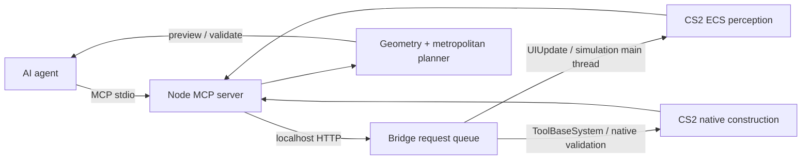
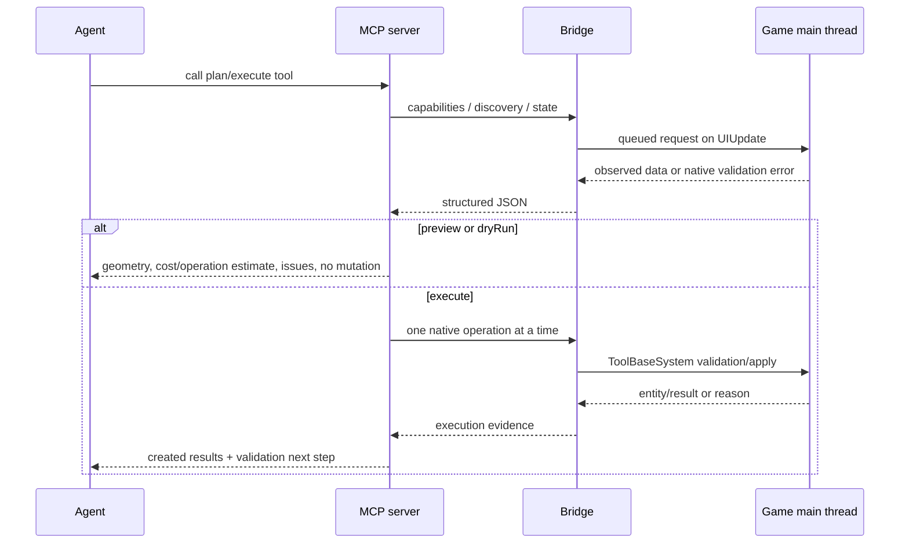

# Architecture

## What is verified today

This project is an extension of the LancerComet CS2MCP bridge. It is a local MCP server plus an in-process CS2 code mod. The bridge is the authority for game state and native mutation; the planner never writes Unity ECS from the Node process.

The current build has two distinct kinds of feature:

- Native, executable paths: city perception, terrain/water/GridMap readings, runtime PrefabSystem discovery, grid-aware building/tree placement with native road-access preflight, native surface areas, terrain tools, network construction, road upgrades, native zoning, districts, finance/policies, simulation, exact-save load/rollback, cameras, screenshots, bulldozer deletion, transport stops/stations/depots, cardinality-changing transport-route mutation, and physical track-segment construction.
- Plan-only or explicitly unavailable paths: generic arbitrary-object recoloring, station/depot subobject route attachment, and tunnel construction when the installed runtime has no unlocked network prefab exposing `PlaceableNetData.m_UndergroundPrefab`. Native per-vehicle dispatch is available through the game's `TransportVehicleRequest` path and is only successful after `RouteVehicle` readback. Tunnel support is therefore a live capability probe, not a hard-coded boolean: discovery returns the structural underground-prefab reference, while construction still requires an exact runtime selection and native readback. Native transport route-line creation/modification/deletion, waypoint insertion/removal, readback, stop binding, line schedule/settings mutation, read-only line analytics, road/lane/traffic graph observation, native resources/wind/outside-connection observation, utility graph observation, live object relocation/copy, tile purchase, and terrain/prop/surface paths are available as separate main-thread definition or native-reader paths, each with capability gating and preview/readback semantics.

The distinction is returned by `cs2_capabilities` and is also encoded in the C# `/capabilities` response. No planner result should be interpreted as a successful game mutation unless it contains an execution result from the bridge.

## Runtime flow

## Layers

### Perception

The C# layer in `CS2MCP.Bridge/` runs inside the game process. `HttpBridgeServer` accepts localhost requests on a background listener thread and puts non-ping requests on `BridgeSystem`'s concurrent queue. `BridgeSystem.OnUpdate` drains that queue on the simulation/UI thread. This is the important safety boundary: Unity ECS reads and writes happen only from the game thread.

Current perception includes:

- game state, city overview, demand, budget, services, labor, statistics, tax/policy/fee state;
- native terrain height and water-depth samples;
- native cell maps for land value, pollution, and groundwater;
- bounded building/road/object/prop lists, zoning summaries, notifications, entity inspection, districts, and camera state;
- runtime prefab queries backed by `PrefabSystem`, with pagination and lock/availability data for building, road, net, tree, prop, surface, terraform, brush, and transport categories;
- screenshots for visual verification.

`RequestHandlers.Capabilities.cs`, `RequestHandlers.Build.cs`, `RequestHandlers.Surface.cs`, `RequestHandlers.Terrain.cs`, and `RequestHandlers.Management.cs` intentionally describe the limits of that surface. Props use `StaticObjectPrefab` plus the native object definition path; surfaces use `SurfacePrefab` plus area nodes; terrain uses the owning tool system's `ToolOutputBarrier` and `CreationDefinition`/`BrushDefinition` path; object relocation uses `CreationDefinition(Relocate)` plus `ObjectDefinition` and is verified with `/entity/inspect`. The bridge does not claim transit-stop or traffic-graph behavior that it cannot observe.

### Construction

`BridgeToolSystem` owns the asynchronous tool operations. Building roads and buildings goes through the game's definition/validation/apply path. Demolition goes through the bulldozer path so nodes, lanes, blocks, and ownership cleanup are handled by the game.

The Node layer can request one native segment or a compound path. Compound paths are first expanded by `geometry.ts` into native-sized segments (maximum 1500m by default), then each segment is sent to `/build/road`. A response is not considered a plan success: the caller must inspect the returned native result and run validation.

### Planning

`mcp-server/src/geometry.ts` is pure deterministic planning code. It does not know asset names or mutate the game. It provides:

- straight, Bezier, arc, spline, and polyline sampling;
- segment splitting, length/grade/bounds checks, and structured `PlanIssue` results;
- diamond/roundabout/cloverleaf/turbine/stack-style interchange previews with footprint/conflict output;
- terrain summaries from the native height/water grid;
- metropolitan plans with one primary centre, multiple secondary centres, growth rings, non-grid radial corridors, district polygons, greenways, transport spines, phases, and quality gates.

`mcp-server/src/autonomy.ts` is the orchestration layer. It fetches live evidence, selects exact runtime prefab names when the caller does not provide one, applies capability gates, and exposes plan/preview/execute/validate tools.

## Request lifecycle and failure semantics

Errors are designed for an AI repair loop. A useful failure contains `success:false`, a reason/category, the affected segment or object where possible, and a recommended action. The planner's own issues use `code`, `severity`, `message`, and `recommendedAction`. Unknown capability is never converted to an empty result.

## Dynamic discovery and compatibility

There is no maintained `RoadA/BuildingA/TreeA` allow-list. `cs2_discover_assets` queries the currently running `PrefabSystem` and supports `all`, `building`, `road`, `net`, `tree`, `prop`, `surface`, `terraform`, and `brush` categories with `page`/`pageSize`. The bridge reports the internal prefab name, runtime entity id, prefab type, lock/availability, optional localization, and conservative source assembly metadata.

The source metadata intentionally does not pretend to distinguish DLC, Creator Pack, Region Pack, Asset Mod, and Code Mod when the runtime does not expose a reliable attribution in this bridge. Agents should use the exact runtime name and native validation, not a guessed provenance.

The game version is reported through `Application.version`; the bridge also states when a Steam build id or a capability is not exposed. Future compatibility work should add feature probes rather than hard-coded game-version branches.

## Coordinates, paging, and performance

All tools use CS2 world coordinates: `x` and `z` are planar meters, `y` is elevation in meters, and rotations are degrees around positive `y`. The default map bounds are approximately `[-7168, 7168]` on both planar axes, but the game remains authoritative.

Large responses are bounded. Terrain is sampled at a requested resolution; prefab and entity lists are paged or limited; area analysis uses a bounding box and radius. A metropolitan plan is a compact plan object, not a serialized ECS dump.

## Transaction boundary

`cs2_execute_master_plan` defaults to preview. With `execute=true`, it:

1. requests a preflight save and keeps its exact native save id;
2. pauses the simulation;
3. executes bounded road/district/zoning/service/transit/landscape phases through native endpoints;
4. captures screenshots and re-reads native validation/overview evidence;
5. on a serious failure, pauses and requests `/game/rollback`, then claims recovery only after the load response and `/state` confirm the city is loaded;
6. resumes only when requested and all required gates pass.

The rollback path is capability-gated. The source contract currently exposes native save/load/rollback, while a fresh post-rebuild game-session check remains a separate acceptance step; a failed or unavailable load is reported as unresolved rather than treated as recovery.

## Extension rules

When adding a new game capability:

1. add a native main-thread endpoint;
2. add a boolean and detail entry to `/capabilities`;
3. add a typed MCP tool with preview/dry-run semantics;
4. add a negative test for the unsupported or invalid case;
5. compile against the installed Managed assemblies;
6. playtest in a disposable save and verify with state/entity/screenshot evidence;
7. document the exact endpoint, failure responses, and compatibility behavior.

Never enable a capability merely because a class, enum, or method exists in a decompiled assembly. Runtime behavior is the acceptance evidence.
